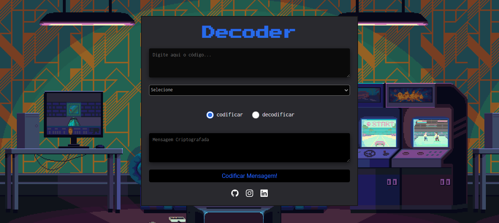

<h1 align="center">Decoder</h1>

🔒 Segundo projeto individual do curso Programadores Cariocas, realizado pelo Senac RJ e Resilia.

## 💻 Projeto

O Decoder é uma aplicação desenvolvida para ser capaz de codificar e decodificar mensagens inseridas pelo usuário, utilizando tanto Base64, quanto Cifra de César.

## 🚀 Tecnologias

Esse projeto foi desenvolvido com as seguintes tecnologias:

- HTML
- CSS
- Javascript 